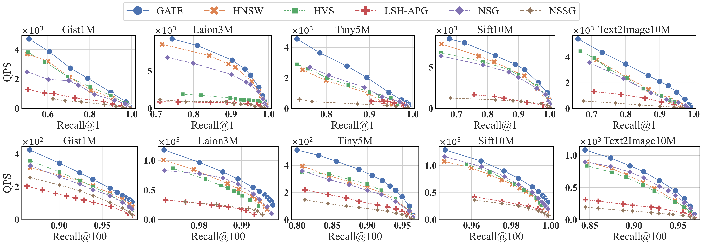

# GATE

This repository contains the source code for our paper: **Empowering Graph-based Approximate Nearest Neighbor Search with Adaptive Awareness Capabilities**.

[](https://doi.org/10.5281/zenodo.15523070)


## 1 Abstract

This paper introduces GATE, a lightweight and adaptive module that enhances graph-based Approximate Nearest Neighbor Search by identifying optimal entry points in proximity graphs using a contrastive learning-based model.


## 2 Competitors

- HVS ([paper](https://www.vldb.org/pvldb/vol15/p246-lu.pdf)): employs a hierarchical structure of multiple PQ layers to reduce computational costs.

- HNSW ([paper](https://arxiv.org/pdf/1603.09320)): a state-of-the-art navigable small world graph.

- LSH-APG ([paper](https://www.vldb.org/pvldb/vol16/p1979-zhao.pdf)): facilitates fast ANNS using a lightweight locality-sensitive hashing framework.

- NSG ([paper](https://arxiv.org/pdf/1707.00143)): an approximation of the monotonic relative neighborhood graph.

- NSSG ([paper](https://arxiv.org/pdf/1907.06146)): an extension of NSG optimized for out-of-index queries.


## 3 Datasets

The data format is: Number of vector (n) * Dimension (d).

|                           Dataset                            | Base Size  | Dim  | Query Size | Modality |
| :----------------------------------------------------------: | :--------: | :--: | :--------: | :------: |
| [Gist1M](https://www.cse.cuhk.edu.hk/systems/hash/gqr/datasets.html) | 1,000,000  | 960  |   1,000    |  Image   |
|   [Laion3M](https://laion.ai/blog/laion-400-open-dataset/)   | 3,000,000  | 512  |   1,000    |  Multi   |
| [Tiny5M](https://www.cse.cuhk.edu.hk/systems/hash/gqr/datasets.html) | 5,000,000  | 384  |   1,000    |  Image   |
| [Sift10M](https://www.cse.cuhk.edu.hk/systems/hash/gqr/datasets.html) | 10,000,000 | 128  |   1,000    |  Image   |
| [Text2Image10M](https://research.yandex.com/blog/benchmarks-for-billion-scale-similarity-search) | 10,000,000 | 200  |  100,000   |  Multi   |


## 4 Building Instruction


### Prerequisites

- GCC 4.9+ with OpenMP
- Python 3.9+
- CMake 2.8+
- Boost 1.55+


### Compile On Linux

```bash
$ mkdir build/ && cd build/
$ cmake ..
$ make -j
```


## 5 Usage

### Code Structure

- **cluster**: GATE python package, including subgraph sampling, query-aware sample generation, model training and inference.
- **include**: C++ class interface
- **src**: main function implementation
- **test**: test codes


### How to use

#### Building GATE

##### Step 1. Build kNN Graph and Indexing NSG

Firstly, we need to prepare a kNN graph. You can use Faiss and other libs. 

Then run the script for indexing NSG:

```
./tests/test_nsg_index DATA_PATH KNNG_PATH L R C NSG_PATH
```

- `DATA_PATH` is the path of the base data in `fvecs` format.
- `KNNG_PATH` is the path of the pre-built kNN graph.
- `L` controls the quality of the NSG.
- `R` controls the index size of the graph.
- `C` controls the maximum candidate pool size during NSG contruction.
- `NSG_PATH` is the path of the generated NSG index.


##### Step 2. Hub Nodes Extraction and Topological Semantic Generation

```shell
python -m cluster.kmeans DATA_PATH HUB_PATH
python -m cluster.subgraph2json NSG_PATH DATA_PATH HUB_PATH SUBGRAPH_DIR
```

- `DATA_PATH` is the path of the base data in `fvecs` format.
- `NSG_PATH` is the path of the generated NSG index.
- `HUB_PATH` is the path of the hub nodes extraction.
- `SUBGRAPH_DIR` is the subgraph dir

Then, we run the graph embedding model, convert subgraph to embeddings. You can use [Graph2Vec](https://github.com/benedekrozemberczki/graph2vec) and other model.


##### Step 3. Query-aware Sample Generation, Model Training and Inference

```
./test_nsg_search DATA_PATH QUERY_PATH NSG_PATH SEARCH_L SEARCH_K RESULT_PATH HUB_PATH HOP_PATH
python -m cluster.experiment.combine_ep_gt HOP_PATH SAMPLE_PATH
```

- `DATA_PATH` is the path of the base data in `fvecs` format.
- `QUERY_PATH` is the path of the query data in `fvecs` format.
- `NSG_PATH` is the path of the pre-built NSG index in previous section.
- `SEARCH_L` controls the quality of the search results.
- `SEARCH_K` controls the number of result neighbors we want to query.
- `RESULT_PATH` is the query results in `ivecs` format.
- `HUB_PATH` is the path of the hub nodes extraction.
- `HOP_PATH` is the path of the routing hop.
- `SAMPLE_PATH` is the path of the traning sample data.


Then configure the trainning parameters, run `cluster/model/__main__.py` to train the model and run `cluster/model/infer.py` to get hub nodes' embeddings when model trained.

```json
{
    "input_dim": 128,
    "hidden_dim": 2024,
    "output_dim": 512,
    "dropout": 0.05,

    "batch_size": 16384,
    "lr": 1e-5,
    "temperature": 0.07,
    "epochs": 200
}
```


#### Searching via GATE

```shell
./tests/test_gate_search DATA_PATH QUERY_PATH NSG_PATH SEARCH_L SEARCH_K EMB_PATH RESULT_PATH
```

- `DATA_PATH` is the path of the base data in `fvecs` format.
- `QUERY_PATH` is the path of the query data in `fvecs` format.
- `NSG_PATH` is the path of the pre-built NSG index in previous section.
- `SEARCH_L` controls the quality of the search results.
- `SEARCH_K` controls the number of result neighbors we want to query.
- `HUB_PATH` is the path of the hub nodes extraction.
- `EMB_PATH` is the path of the hub nodes' embeddings.
- `RESULT_PATH` is the query results in `ivecs` format.


## 6 Performance

- QPS (for graph-based method)


